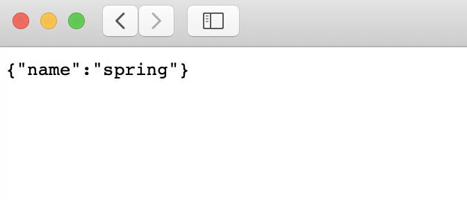
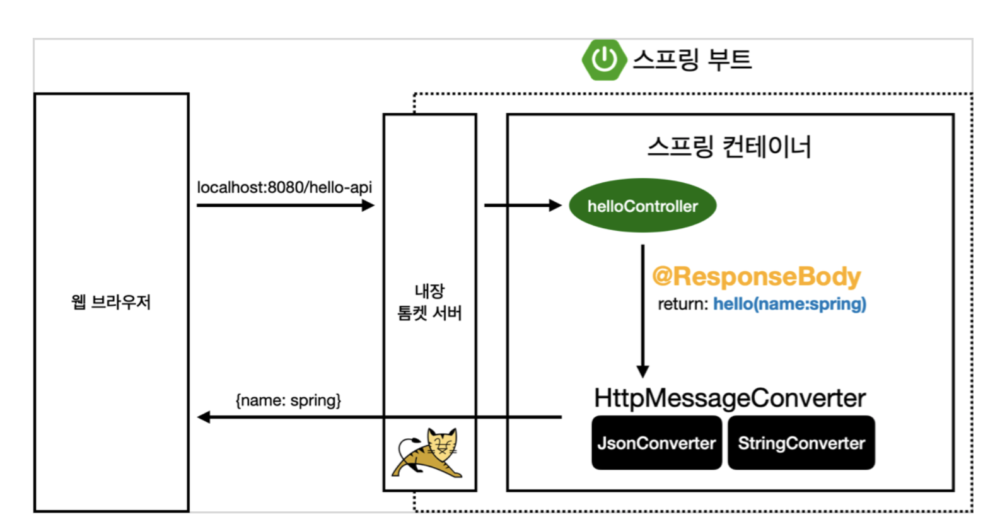

# API

* 정적컨텐트를 제외하면 MVC, API 방식 두가지가 존재한다.
* html 형식으로 내려주면 MVC이다.
* 데이터 형식으로 내려주면 API 방식이다.

## 

* http는 헤더부와 바디부가 존재한다.
* "@Responsebody": http의 바디부에 반환값 "hello" + name 을 직접 넣어주겠다는 의미
* view 개념과는 별개로 데이터가 그대로 내려간다. -> 브라우저에서 소스보기를 하면 html 태그 표시가 되지 않는다.
~~~
    @GetMapping("hello-string")
    @ResponseBody
    public String helloString(@RequestParam("name") String name){
        return "hello "+name;
    }
~~~

## api 방식

* @ResponseBody를 통해 view와는 별개로 바로 전달한다.
* 클래스를 통해 객체를 생성하여 객체를 전달한다. 

~~~
    @GetMapping("hello-api")
    @ResponseBody
    public Hello helloApi(@RequestParam("name") String name){
        Hello hello = new Hello();
        hello.setName(name);
        return hello;  //문자가 아닌 객체를 넘겼다.
    }

    static class Hello{  //static 클래스로 만들면 내부에서 클래스 사용이 가능하다.

        private String name;

        public String getName(){
            return name;
        }

        public void setName(String name){
            this.name = name;
        }

    }
~~~

### json 방식
* key-value로 이루어진 방식이다.
* 현재는 json 방식(key-value)으로 반환하는 것이 기본이다.
* 과거 xml방식 -> html 태그이용해서 반환해서 불편하다.

## @ResponseBody 동작원리

1. 웹브라우저가 url 넘겨 톰켓 서버가 전달받은 후 스프링에게 넘겨준다.
2. 스프링은 특정 컨트롤러(helloController)에서 Getmapping 된 것을 확인후 해당
3. 이전에는 템플릿이 viewresorlver에게 던져 자신에게 맞는 템플릿을 찾아 전달받기를 기다렸다.
4. 반환값이 문자의 경우 http 응답에 바로 전달하였다.
5. 반환값이 객체의 경우 json 형식으로 바꿔 반환하려고 한다.(기본 정책)

* responsebody 가 있으면 HttpMJessageConverter가 동작한다.
* HTTP의 body에 문자 내용을 직접 반환
* viewresolver 대신 httpmessageconverter 가 동작한다.
* 기본 문자처리: StringHttpMessageConverter
* 기본 객체처리: MappingJackson2HttpMessageConverter (jason형식으로 바꾸어주는 라이브러리)
* byte 처리 등등 기타 여러 HttpMesssageConverter가 기본으로 등록되어 있음

