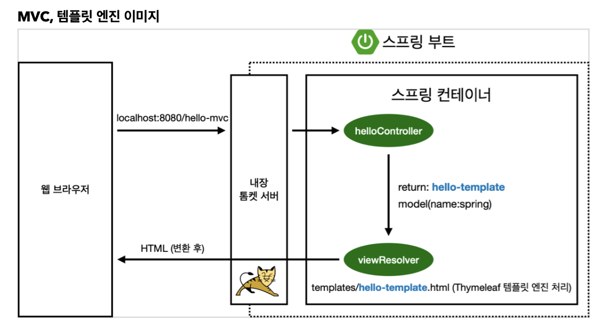

# MVC와 템플릿 엔진

* MVC: model, view, controller
* view는 화면을 나타내는 모든 기능이 집중된다. 화면과 관련된 일
* model과 controller를 나누는 것이 중요
* model, controller는 내부적인 단계

## Controller

* localhost8080/ + GetMapping 어노테이션에 들어갈 단어와 같음
* ViewController가 받은 url에서 해당되는 단어와 일치하는 것이 있으면 해당 메서드 실행
* *RequestParam을 통해 파라미터 설정 -> url에서 ? 다음에 값을 작성한다.
* 값 -> String name -> name(model.addAttribute) 전달된 후 모델이 받는다.
* model.addAttribute에서 "name"은 키를 의미한다.
* 파라미터 부분의 "name"은 url 단어와 일치하는 것을 의미

~~~
@Controller
  public class HelloController {
@GetMapping("hello-mvc")
public String helloMvc(@RequestParam("name") String name, Model model) {
model.addAttribute("name", name);
return "hello-template"; }
}
~~~

* '$'는 model에서 값을 가져온다.
* ${name}은 key 값이 name인 값을 model에서 가져와 치환한다.
~~~
<html xmlns:th="http://www.thymeleaf.org"> 
<body>

hello! empty
 
</body>
</html>
~~~

## 동작 원리

1. 웹브라우저에서 주소를 던지면 스프링 부트의 내장 톰캣을 먼저 거친다.
2. 톰캣 서버는 스프링한테 해당 정보를 던진다.
3. 스프링은 hellocontroller의 특정 메서드와 매핑된 것을 확인한 후 호출한다.
4. 해당 메서드는 hello-template과 model(name:spring) (key->name, value->spring)를 스프링에게 넘겨준다.
5. 스프링은 viewResolver(화면과 관련한 해결자)을 실행시킨다.
6. viewResolver은 templates/hello-template.html을 찾아서 Thymeleaf 템플릿 엔진에게 처리할 수 있도록 넘긴다.
7. 템플릿은 엔진은 렌더링해서 html 형태로 변환 후 웹브라우저에게 넘겨준다.
8. 정적의 경우 변환을 하지 않고 그대로 넘겨준다.

