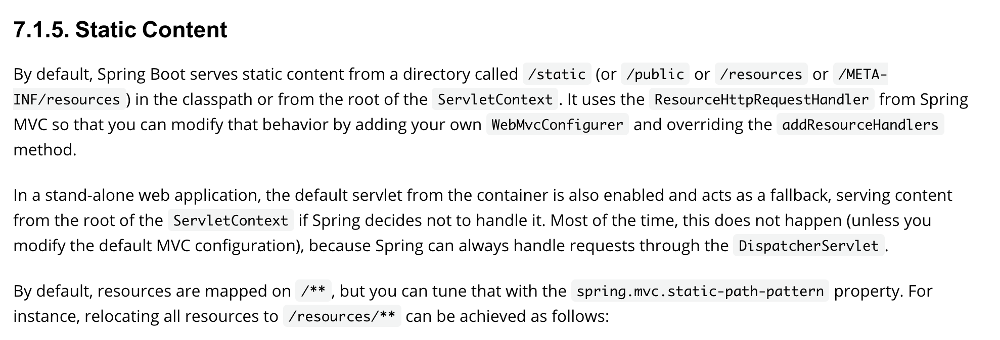
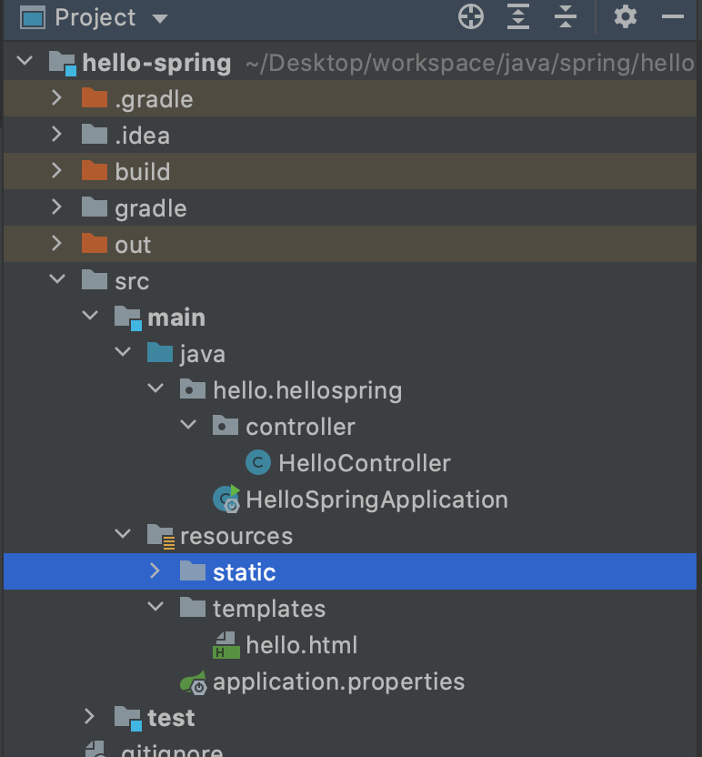
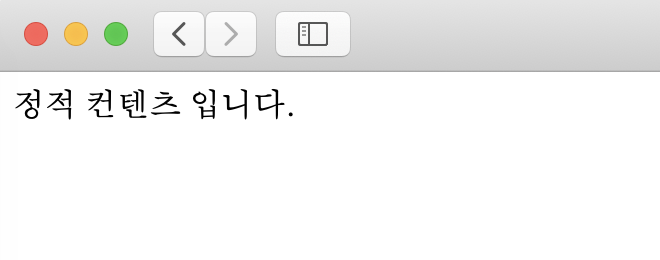

# 정적컨텐츠

* 스트링 부트는 기본적으로 정적 컨텐츠를 제공한다. 

## 정적 컨텐츠 생성
* static 폴더에서 생성가능

* html 코드 작성
~~~
<!DOCTYPE HTML>
<html>
<head>
    <title>static content</title>
    <meta http-equiv="Content-Type" content="text/html; charset=UTF-8" /> </head>
<body>
정적 컨텐츠 입니다.
</body>
</html>
~~~

* 서버 실행 후 다음과 같이 접속
~~~
localhost:8080/hello-static.html
~~~

## 정적 컨텐츠 동작원리

1. 웹브라우저가 localhost:8080/hello-static.html을 톰캣에게 넘겨준다.
2. View Controller가 관련 컨트롤러가 있는지 찾는다.
3. 컨트롤러가 없기때문에 resources에서 static의 해당 html 파일을 찾아서 웹프라우저에게 보내준다.