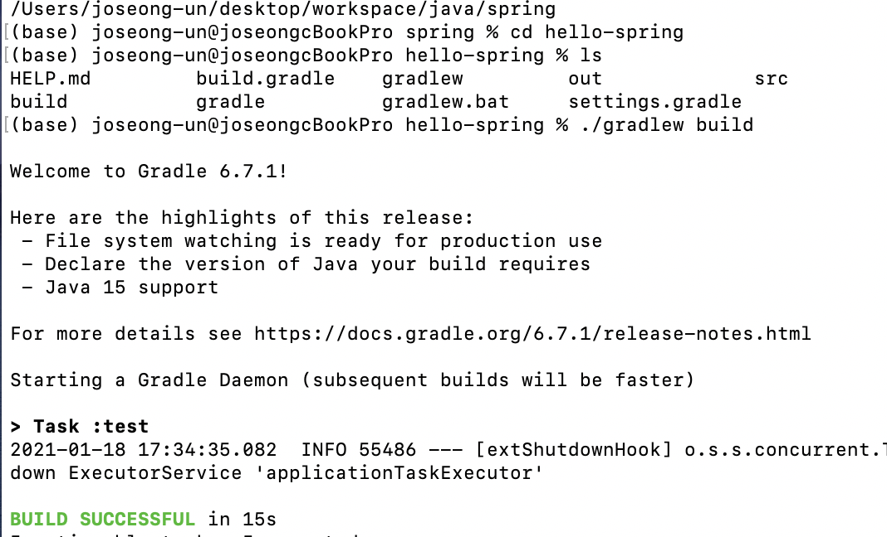
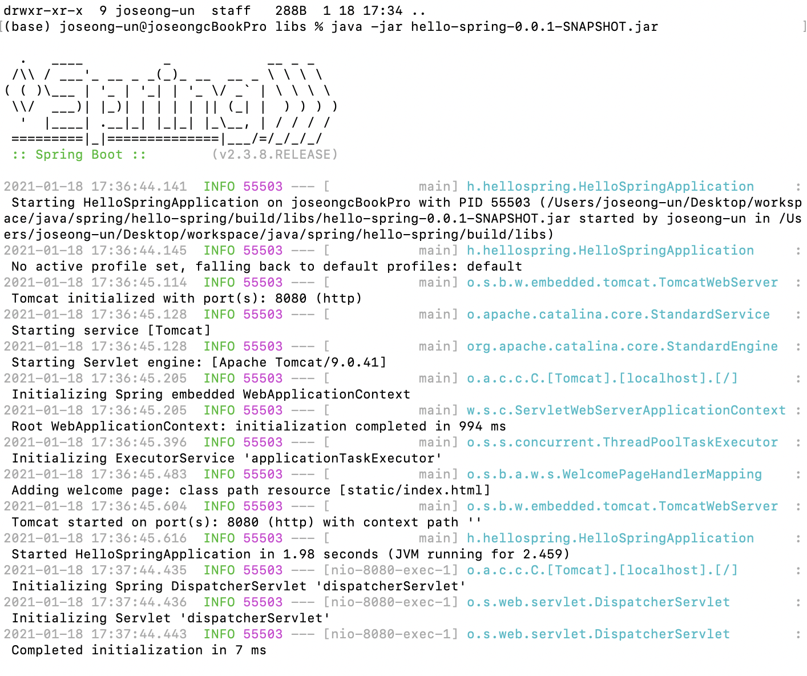

# 빌드하고 실행하기

* hello-spring 폴더로 이동후 gradle 빌드
~~~
./gradlew build
~~~

* 안될시 비우고 다시 빌드
~~~
./gradlew clean build
~~~

* build > libs 로 이동 후 jar 파일 실행
~~~
cd build/libs

java -jar jar파일이름
~~~

* 종료시 control+C 입력

